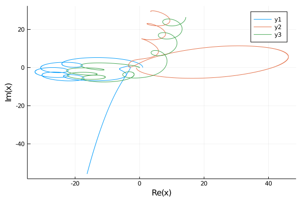

# Welcome to Code the Matrix!


## A hackathon with a twist!

Instead of giving obscure questions that no one will ever use, we explain common methods used in analyzing radio data, simulation methods etc and you, the participant, write the code to implement these, all in a fun, story form.

You can use any language of your choice, but obviously, Python is preferred. You can also use different languages for different questions. And again, only skills learnt in IDC101 are used.

Before starting **please [register](https://forms.gle/Yd5B49sbfW4U1yub8)**. We will not be able to accept your solutions without you registering.
Each team of **maximum 3 people** needs to register only once.

Also join the WhatsApp group for doubts, hints etc. Link will be shared on Φ@I and Turing Club groups to prevent spamming.

## Coordinators

- Dhruva - +91 99453 80169
- Aabhas - +91 98180 32178

# An Adventure in The Matrix

As you drift through the Matrix aether, on Planet 994QW$T@3, you receive a number from a blocked hexadecimal code. You are called upon by the Commander Supreme to the hardest and most important mission ever. Complete the objectives to complete the mission!

## Objective 1 - Planning Lift Off! - 20, +5 for the short version

Your rockets can be fueled by many different fuel cylinders. With 4D injection technology, you can have any number of fuel cylinders added to your ship.

Headquarters will provide a list of cylinder quantities, and how much fuel is necessary for the mission.

Obviously, due to budget constraints (strange, how despite being the most important mission ever, there are still budget constraints. They did have the money to pay for that lounge area in the garden though...), you cannot take more fuel than necessary.

**You need to tell Headquarters how many combinations of cylinders are there, which can give exactly the necessary amount of fuel.**

*Hint:* The number of ways to fuel for $$N=n+m$$ liters is the number of ways to fuel for $$n$$ liters times the number of ways to fuel for $$m$$ liters. **The order DOES NOT matter.** `[1, 2] == [2, 1]`

```none
[In]
net_fuel = 4 and cylinders = [1, 2, 3]
[Out]
4 solutions => {[1,1,1,1], [1,1,2], [2,2], [1,3]}

[In]
net_fuel = 10 and cylinders = [2, 5, 3, 6]
[Out]
5 solutions => {[2,2,2,2,2], [2,2,3,3], [2,2,6], [2,3,5], [5,5]}
```

## Objective 2 - Fuel Knocking - 10+30+10+10
  
Recent research has suggested that adding very low concentration of Polydymium to fuel greatly increases efficiency. Research has also suggested that the Polydymium does not interact with the fuel, chemically or physically. However, Polydymium atoms do attract each other by a potential energy dependant on the **distance between the particles** $$x$$

$$E(x)=D\left({\left(\frac{r}{x}\right)}^{12}-{\left(\frac{r}{x}\right)}^{6}\right)$$

Simulate how these atoms spread in a container by assuming that **each** atom's position is a `list` of 2 numbers (obviously, the x and y coordinates).

1. In each step of the simulation, move a random atom by a small distance `d` in a random direction (this can be done by adding a random number between `-d` and `d` to each component of the particle's position).
2. Calculate the net energy by summing the energy of all pairs. Keep in mind that you do not double count pairs, and you don't take an object with itself as a pair.
3. If the energy reduces, then continue. Else, continue with a probability P(continue) or **revert** otherwise.

$$P(continue)=exp\left(-\frac{E'-E}{kT}\right)$$

4. Repeat for `num_steps` steps.

5. After every `num_steps/1000` steps, plot the locations of the particles as a scatter plot, and create an animation of this.

**Tip for animation:**

You can save each plot as an image, and finally, make a gif out of these using any online/downloadable converter.

Use the following values-

```python
D = 30
r = 50
d = 0.2
kT = 1000
num_steps = 2e5
num_particles = 50
# Let the positions of 50 particles be in the square (-2,-2) to (2,2)
initial_position = numpy.array([numpy.random.random(2)*4-2 for _ in range(num_particles)])

# for best results, set the limits of the plot (-3*D, 3*D) for both axes
```

An animation I created for the same values but with $$10^6$$ `steps`-

<video src="ctm/file.mp4"></video>

## Objective 3 - No Shortcuts in Life - 20+20, +5 for optimization

Now that your fuel is in order, figure out a path to meet all the planets and wormholes EXACTLY ONCE in the shortest path. Why? Budget limits.

Supreme Commander will give you a list of the locations of the planets, again as a `list of 3-lists`. The distance between the planets is simple Euclidean distance.

Of course, to make things "easier", there are wormholes which can take you from one wormhole to another instantly, and without taking any fuel. Supreme Commander will also give you a list of positions of the wormholes similar to that of the planets. The distance between a planet and a wormhole is the euclidean distance.

Print the order of visiting celestial bodies. Supreme Commander understands that this is not easy, and so, ve (vis preferred pronoun) has allowed you to use the networkx module (and equivalent in other languages, docs for python [here](https://networkx.github.io/documentation/stable/install.html)). Using the module is not a necessity, but some semblance to a graph must be made.

List of Bodies -
| Name      | x         | y       | z       |
| --------- | --------- | ------- | ------- |
| Planet 0  | 0.0       | 0.0     | 0.0     |
| Planet 1  | 4.08843   | 4.69975 | 5.41835 |
| Planet 2  | 1.01513   | 5.89078 | 1.48675 |
| Planet 3  | 6.04748   | 3.76679 | 5.91324 |
| Planet 4  | 1.18806   | 3.26168 | 4.75359 |
| Planet 5  | 5.81472   | 3.50833 | 3.5276  |
| Planet 6  | 1.78623   | 1.80381 | 4.97739 |
| Planet 7  | -0.618259 | 6.18706 | 3.0477  |
| Planet 8  | 1.3763    | 3.78712 | 5.16773 |
| Planet 9  | 5.68307   | 4.41375 | 5.18493 |
| Planet 10 | 1.27576   | 5.36594 | 3.70002 |
| WH1       | 2.0       | 3.0     | 4.0     |
| WH2       | 0.0       | 5.0     | 2.5     |
| WH3       | 5.0       | 5.0     | 5.0     |

**Hint:** Find the distance between each set of bodies, then find the shortest path which visits each body exactly once

## Objective 4 - Come in Houston - 10+10

We really need to set up a secret mode of communication, right? All information is naturally shared only via our patented _2-num_ format, where everything is made up of 0s and 1s. Each message is made up of two strings in the _2-num_ format, the first part is the verification check, and the second part is the actual message.
Now the first part is a secret key. If the first part follows the following rules, it's actually sent by Headquarters.

1. The string begins with an '0'
2. Each '0' is followed by nothing or an '0' or "11"
3. Each "11" is followed by nothing or an '0'

If you verify that the message is in fact sent by the Headquarters, then convert the second part in the following way -

1. Take every 6 characters in the _2-num_ format, and calculate the number in _10-num_ format.

$$(abcde)_{2-num} = (a*2^5 + b*2^4 + c*2^3 + d*2^2 + e*2^1 + f*2^0)_{10-num}$$

2. Take the _10-num_ and use the below table to convert it into normal text.

```python
['0'-'9' <= 0-9, 'a'-'z' <= 10-35, ':' <= 36, '/' <= 36, '?' <= 37, '=' <= 38, '.' <= 39]
```

3. Do as message asks you to do

```python
# Test using:
["001101100011", "010001011101011101011001011100100100100100100100100000100000100000100111100010011000011110011101011110001011001110100111001100011000010110100100100000001010011101001100010001100101011111100110001101011010100000000100100000001001100000010000100001001100011010"]
```

## Objective 5 - Going Round and Round - 10+10+10

3 objects, only gravity, simulate.

**Each object has 3 properties:**

1. a mass \[number\]
2. a position \[list of 2 numbers\]
3. a velocity \[list of 2 numbers\]

Implementation-

0. let time = 0
1. Calculate the force on each particle by the other two as a vector. $$a$$
2. Multiply the time step with the acceleration to get the change in velocity. $$\delta v = a*dt$$
3. Add the change in velocity to the old velocity. $$v \leftarrow v + \delta v$$
4. Multiply the velocity with the time step to get the change in position. $$\delta x = v*dt$$
5. Add the change in position to the old position. $$x \leftarrow x + \delta x$$
6. Increment time by dt
7. repeat until `time > end_time`
8. Plot the path of the 3 bodies

Take these values:

```python
G = 1
masses = [4, 4, 1]
positions = [[1,0], [-1,0], [0,0]]
velocities = [[0,1.556], [0,-1.556], [0.001556,0]]
```

**Hint:** Use complex numbers!

_Optional:_

1. _Extend this to include any number of objects, and also add a bounce/merge/break strategy for a more accurate simulation. Also, look at Barnes-Hut optimization for larger number of bodies._
2. _Animate the path_

My plot looks like this-



## Objective 6 - My battery is low and it’s getting dark - 30

A decade and a half after launch to an alien world, the fact that a rover can still broadcast messages is extraordinarily impressive.
But our (remember you are from Planet 994QW$T@3, so no anti-nationalism) rover didn't even last a year without malfunctioning.
Due to cost-cutting in the steering column, the rover doesn't turn 45% of the times. But it goes straight just fine.

Download the file which has the instructions that needs to be sent to the rover.

- "R" => turn right 90 degrees, "L" => turn left 90 degrees, "F" => move forward.
- You start off pointing North at (0,0).

Run the code 150 times and display the average distance from the ACTUAL location where the bot should be. If its greater than 37, you need to tell the HQ to euthanize the rover.

**Hint:** You could use complex numbers

[Download the path to be sent from here](ctm/path.txt)
