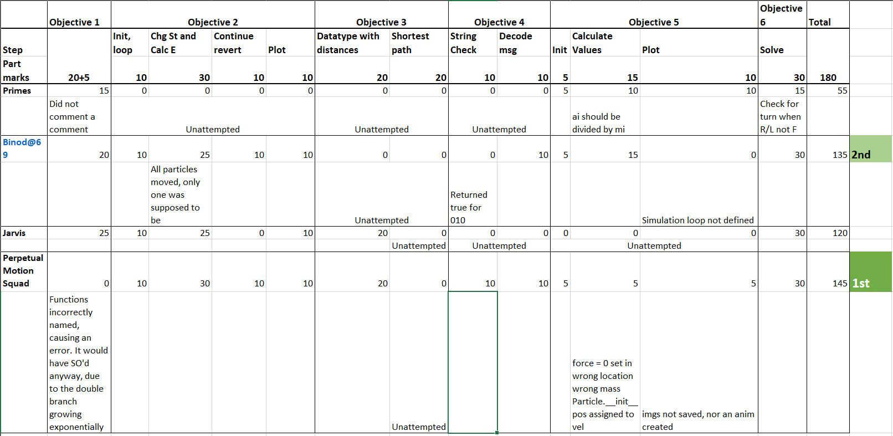

# CTM Results and Discussion

## Discussion

### Obj 1

This is a rephrasing of the common Counting Change problem. The explanation of how to solve the **Dynamic Programming** problem and the concept of _overlapping sub-problems_ are discussed [here](https://www.geeksforgeeks.org/coin-change-dp-7/).

It seems as if 2 groups have copied from this website, one successfully, one unsuccessfully😝.

### Obj 2

The method of solving has practically been laid out. You can see my implementation in Julia (legible to anyone who knows python) [here](ctm/obj2). 2 groups have almost got it right, 1 completed it. This is a Monte Carlo simulation. For further understanding of many kinds of simulations, use [this coursera course](https://www.coursera.org/learn/modeling-simulation-natural-processes) on Simulation and modeling of natural processes.

### Obj 3

This is the common Delivery Problem, and is a problem in graph theory. It is further complicated by the fact that the distances are non-euclidean(the WHs). A more complex version of it is used in any sort of delivery app (Swiggy etc.). [This Coursera Course](https://www.coursera.org/learn/delivery-problem) has a very nice explanation. [Here](https://www.geeksforgeeks.org/traveling-salesman-problem-tsp-implementation/) is a shorter explanation and implementation.

### Obj 4

The first part is a Context Free Grammar.

L => A
A => 0A | 0B | 0
B => 11A | 11

This can be implemented with a Push Down Automaton. (Take IDC 204 if you are interested)

But this can also be done using a regex. Check _Perpetual Motion Squad's_ implementation.

The second part is a basic encoding mechanism. Commonly used are ascii and unicode.

### Obj 5

This is a common way to solve a double differential equation. You can see my implementation in Julia [here](ctm/obj5). Try extending to 3d, and also use the Barnes Hut optimization. More details in the Simulation and modeling of natural processes [Coursera course](https://www.coursera.org/learn/modeling-simulation-natural-processes).

### Obj 6

This was rather straightforward, but some groups misunderstood the question. See my implementation [here](ctm/obj6).

## Results and Code

The following are the scores -

The following are the participants' code -

1. Primes - [Primes.zip](ctm/Primes.zip)
2. Binod@69 - [Binod@69.zip](ctm/Binod@69.zip)
3. JARVIS - [JARVIS.zip](ctm/JARVIS.zip)
4. Perpetual Motion Squad - [Perpetual_Motion_Squad.zip](ctm/Perpetual_Motion_Squad)
