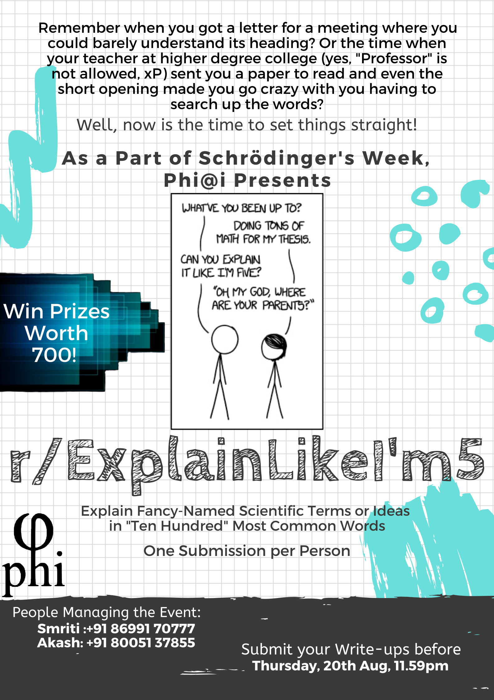

# Explain Like I am Five

## The Event

Remember when you got a letter for a meeting where you could barely understand its heading?
Or the time when your teacher at higher degree college (yes, "Professor" is not allowed, xP) sent you a paper to read and even the short opening made you go crazy with you having to search up the words?

Well, now is the time to set things straight!

Φ@I presents to you the our new event **EXPLAIN LIKE I AM FIVE** as part of the Schrodinger's Week 2020.

This is an event where you have to explain fancy topics  using 1000 most commonly used words in English (The words which a five year old can understand!)

The event is inspired by one of our favorite xkcd comics, UP GOER FIVE in which Randall Munroe explains a rocket using the same concept.

## Rules

1. You would get a challenge on Monday, Wednesday and Friday of the Week, keep an eye on the website for challenges. Monday challenge has been posted below.

2. You have to submit a write up in the topic of your interest along with the actual topic that you are trying to explain.

3. There is a link to a text editor below which tells you if the words you have used are allowed or not.The words used to explain the topic must be allowed by the text editor. On the top right corner of the editor you can also find examples for your reference

4. There is a word limit of 1000 words per submission

5. You can submit only one article per challenge.

6. You can submit entries from all three categories till 22nd August 11:59 P.M!

## Text Editor

**[The-Up-goer-five-Text Editor](https://splasho.com/upgoer5)**

Also check the HINTS and Sample Write-ups at the top right of the above link.

**[1000-Most-Common-Words](/schrodinger-week/1000words)**

Let your imagination run wild!

## Monday Challenge

*Nobel Prize Improvise*

You have to select the Nobel prize 2019 winning research topic in any subject of your choice and explain it like I am 5.

You can take any field of your choice (not necessarily physics)

You have to send the original writeup and your improvised write in a .txt/.pdf/.doc version to phiclubiiserm@gmail.com

As it all started from Randell Munroe's description of Saturn V as up goer 5, we continue to legacy with our second challenge

## Wednesday Challenge

*The Next Einstein*

Here are 2 pictures of one of the most popular topics in physics.
Black holes and LIGO
You take these two pictures and instead of the given labeling, Change it to eli5 version

For black hole image :
Write the original labeling along with your description of it.

For LIGO Image, write the number given in the flow chart and your description along with it.

You have to label both images for your entry to be considered.

### Black Hole image
[Black-Hole](eli5bh.jpg)

### LIGO image
[LIGO](eli5LIGO.jpg)

You have to send your improvised write in a .txt/.pdf/.doc version to phiclubiiserm@gmail.com

## Friday Challenge

So far it was us telling you what to do. Now you tell us!

*As a last and final challenge for eli5 we ask you to go wild!.* 

Take any topic of your choice from any subject, be it a scientific paper, confusing science topic or even a YouTube video for that matter and explain it in eli5 version
Send us your original piece, used along with your write-up (upto 1000 words) in pdf,.txt,.doc format to phiclubiiserm@gmail.com

Last date of submission from any challenge-23rd August 11.59 PM

## Prizes
You will be judged on the creativity and clarity of the idea you're trying to explain.
Every challenge has a prize worth 250 bucks waiting for you to grab!

