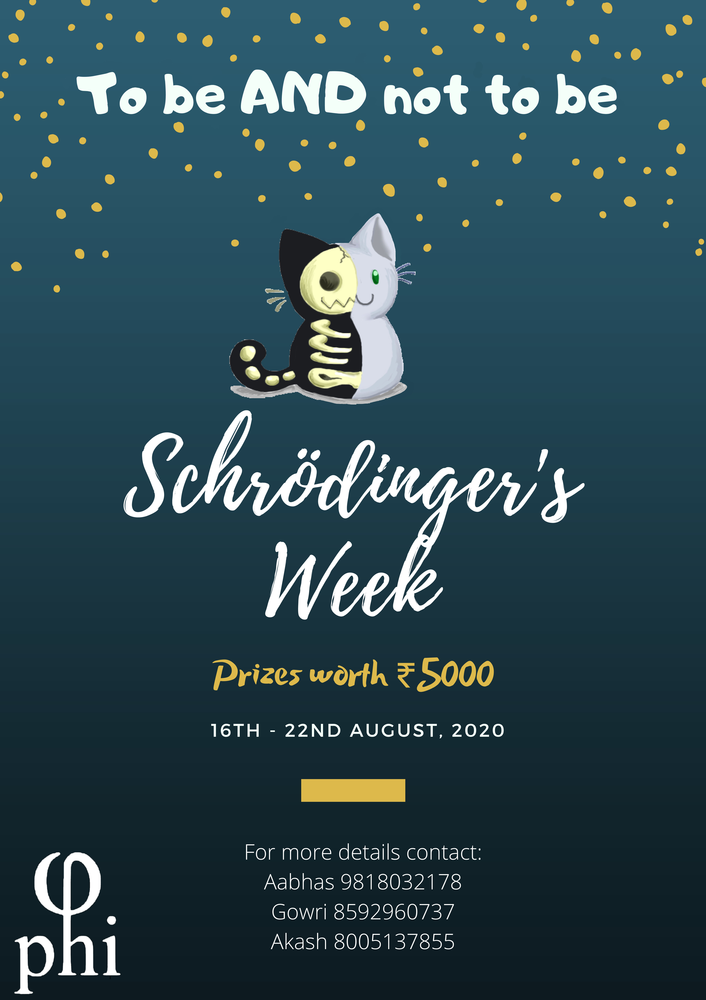

# Hello, Scions of Newton!

We're back through the double slit, and we're keeping our annual promise!

It wouldn't be wrong to say that we all resemble close to the particle in a box now, oscillating at the lowest node (yep, your bed). Φ@i with the active support of other clubs has attempted to bring down the large potential walls around you to ensure your safe tunneling to the world of fun just to unleash your potential and an opportunity to prove how big a physics geek you are!

Providing a safe haven in such precarious times, Φ@i surely presents Schrodinger week 2020 with a new avatar as a completely online event with a promise of delivering a fun and challenging activities that will surely test your mettle!

So choose your favorable dimension and make sure you have your creativity operator set against our challenge hamiltonian!

This year we still have the old classics, Hackathon - **Code The Matrix**, and a Virtual Treasure Hunt(inspired by Turing Club) **GalactiQuest- A Space Adventure**, but this year, we've also tried to come up with new and original online events, **Explain Like I am Five** and **Particle In A Box**.

We also have events on themes of _Science meets Art_, which will run throughout the week, Meme Making - **MEMEATICA**, **T-Shirt Design**, and **Frame It** - An online photography competition with Lumiere.

And that all too with cash prizes worth Rs 5000!

We kick it off on **Monday(17th August)** by a webinar by **Dr. Steffen Rulands** from the _Max-Planck Institute, Germany_.

We hope you all enjoy it!

## Events and Dates

| Event Name            | Day                                | Time          | Prize Money  | Website Link                        |
| --------------------- | ---------------------------------- | ------------- | ------------ | ----------------------------------- |
| Webinar - Dr. Rulands | Monday, 17th August                | -             | -            | -                                   |
| Code The Matrix       | Tuesday, 18th August               | 8pm - 12pm    | 1200         | [/code-the-matrix](code-the-matrix) |
| ELI5                  | Wed - Thursday, 19th - 20th August | -             | 700          | [/eli5](eli5)                       |
| Particle in a Box     | Friday, 21st August                | 4pm - 8 pm    | 700          | [/piab](piab)                       |
| Treasure Hunt         | Saturday, 22nd August              | 6pm onwards   | 1200         | [/thunt](thunt)                     |
| Meme Making           | 21st August (Final Date)           | 11:59 pm      | 300          | [/memes](memes)                     |
| Tee Shirt Designing   | 21st August (Final Date)           | 11:59 pm      | Free T-Shirt | [/tees](tees)                       |
| Frame It!             | Visit Website                      | Visit Website | 300 * 2      | [/frame-it](frame-it)               |
