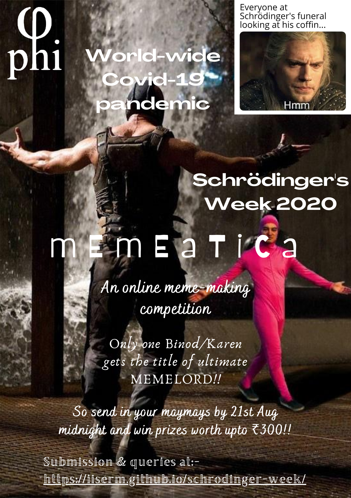

# MEMEATICA

Φ@I presents  **MEMEATICA** as part of the Schrodinger Week 2020.

Do you have what it takes to be a Memelord?
We're looking for dank physics memes, and we know that the IISER-M Memers community won't shy away from our challenge.

Also, didn't we mention?
A prize worth Rs.300 is waiting for the perfect meme!

## Where to submit?

You have to submit your designs to our official IISER Mail ID, [phyclub@iisermohali.ac.in](mailto:phyclub@iisermohali.ac.in) or [phiclubiiserm@gmail.com](mailto:phiclubiiserm@gmail.com) as an attached file, with your name and IISER ID. In case of issues, you can contact the undersigned.

## Rules

1. You have to submit your design as a PNG/JPEG file. Please keep a good resolution in your submissions.
2. Make sure that the meme is original. Any evidence of plagiarism will lead to disqualification.
3. The last date for submission is 21st August 2020, 12 midnight.
4. Avoid memes that can be offensive to people or to a group of people.

## Grading

This time the jury for the competition will be the students of IISER Mohali. We'll upload all the designs we would get on a voting portal, so that people can vote for their favourite designs.

Following democratic principles, the design which gets the most votes would be declared the winner.

LET THE CONTEST....COMMENCE!
May the best Meme Win.

## Coordinators

For any other details contact,

- Aabhas- 9818032178
- Gowri - 8592960737
- Akash - 8005137855
