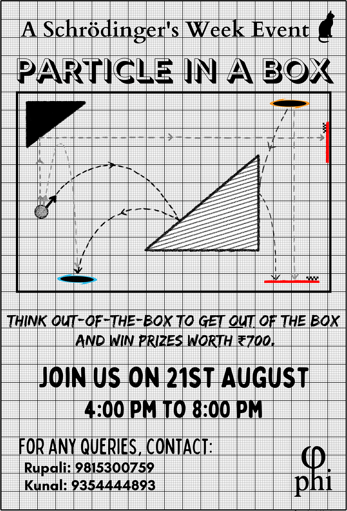

# Particle in a box

Are you someone who enjoys playing physics games or solving physics puzzles?

Now you've got a chance to show your skills, and even win exciting prizes along the way.

We present you with exciting hypothetical scenarios for you to solve, and you, have to find clever ways to solve it!

Requiring only elementary high school physics, we have a collection of original, fun and challenging problems.

And don't you worry about it, they get more challenging...

## I'm interested, what's next?

 1. You can participate as a team of two or as an individual.
 2. The event is on **21st August, from 4 PM to 8 PM**. Set up a reminder, so you don't miss it!
 3. Visit our website [Particle-in-a-box](https://sites.google.com/view/particleinabox) for knowing the details of the game!

## Registrations are open!
[Register Now](https://docs.google.com/forms/d/e/1FAIpQLSfUxgeR-r3mz7IwdfRTUpxgnt4YZuGymfaLYSlrOj2Ax4JuAA/viewform)

If you think you are smart enough to **win ₹700**, come challenge your intellect on **21st of August 4 P.M to 8 P.M.**

Hope to see you there!
