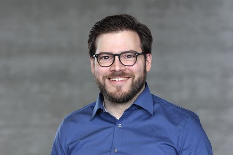

#Webinar

Φ@I as a part of the Schrodinger's Week invites Dr.Stephen Ruland of the Max Planck Institute, Germany to give a talk on **Physics in Biological Processes**

## Title:
Statistical physics of living systems: from molecules to ecosystems

## Date and Time
Date - 17th August 2020
Time - 5 P.M IST

## Abstract

Biological systems rely on an influx of energy from the environment to build complex spatio-temporal structures. Striking examples are the self-organisation of cells into complex organs during embryonic development or the formation of ecosystems involving thousands of species. In this talk, the speaker will show how methods from theoretical physics can shed light on the mechanistic principles underlying biological phenomena and how, vice versa, biological phenomena give rise to new challenges at the frontier of theoretical physics. The speaker will illustrate these points by showing how social insects control stochastic fluctuations in order to simultaneously achieve social specialisation and plasticity.

## About the Speaker
Dr. Steffen Ruland is the Group leader at the Max Planck Institute for the Physics of Complex Systems.
