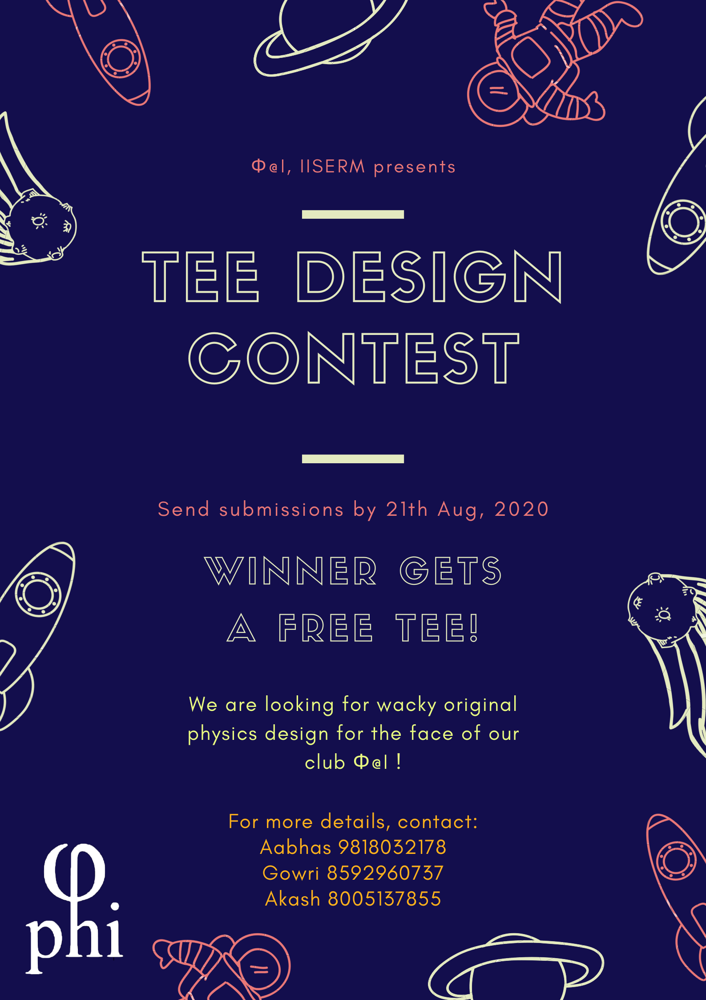

# TEE DESIGN CONTEST

Phi@I presents to you our annual TEE DESIGN CONTEST where you can submit a cool, original, wacky Tee Design, and stand a chance to win an absolutely free Tee of your design and a chance to get featured on the official Phi@I Tee.

## Rules

1. You have to submit your design as a {file format} and your design must have a resolution of atleast 300ppi

2. Make sure that the design doesn't have any translucent elements.

3. Make sure that the design is orginal. Any evidence of plagiarism with lead to disqualification.

4. The last date for submission is 21st August 2020 12 midnight.

## Submission and Grading
This time the jury for the competition will be the students of IISER Mohali. 

**Yes, you read it right!**

We'll put up all the designs we would get online, and people will vote for their favourite designs. The design which gets the most votes would be declared the winner.
